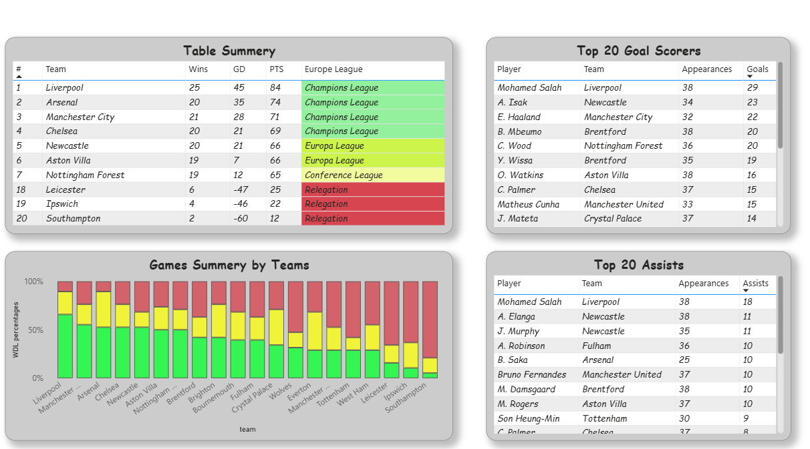
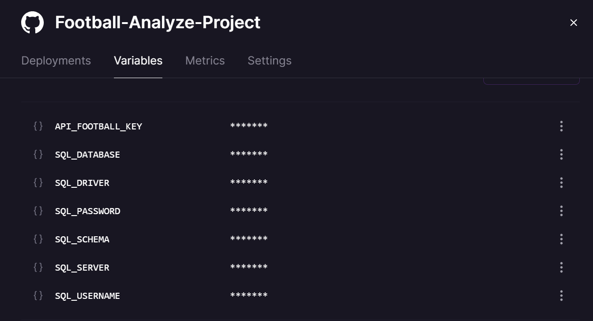
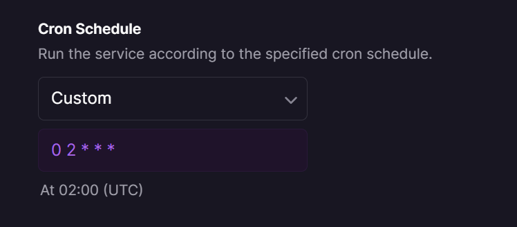

# Premier League Data Pipeline

Automated ETL pipeline that fetches English Premier League data from API-Football, stores it in SQL Server, and visualizes it through Power BI dashboards. Features comprehensive error handling, data validation, logging, and automated testing.

## 📊 What This Does

Collects and updates three key datasets daily:
- **EPL Standings** - Current league table with points, wins, draws, losses
- **Top Scorers** - Leading goal scorers with appearances
- **Top Assists** - Leading assist providers with appearances

### Power BI Dashboard Preview



*Interactive dashboard showing league standings, top scorers, top assists, and team performance breakdown*

## ✨ Key Features

- ✅ **Comprehensive Error Handling** - Retry logic, timeout handling, graceful failures
- ✅ **Data Validation** - Validates data quality and mathematical consistency
- ✅ **Production Logging** - Detailed logs for monitoring and debugging
- ✅ **Unit Tests** - 15+ automated tests with pytest
- ✅ **API Rate Limiting** - Handles rate limits with exponential backoff
- ✅ **Automated Deployment** - Daily updates via Railway cron jobs

## 🛠️ Tech Stack

- **Python 3.11** - Core application
- **API-Football** - Data source (EPL statistics)
- **pandas** - Data transformation
- **SQLAlchemy** - Database ORM
- **SQL Server** - Data warehouse (Local, Azure SQL, or any cloud SQL Server)
- **Docker** - Containerization
- **Railway** - Cloud deployment & automation
- **Power BI** - Dashboard (Direct Query)
- **pytest** - Unit testing

## 📁 Project Structure

```
.
├── catching_data.py       # API data collection with retry logic
├── exporting_data.py      # Main ETL script with validation
├── test_pipeline.py       # Unit tests (15+ test cases)
├── requirements.txt       # Python dependencies
├── Dockerfile            # Container configuration
├── .env                  # Environment variables (not committed)
├── .gitignore            # Git ignore rules
├── pipeline.log          # Application logs (generated)
├── images/               # Screenshots for README
└── README.md            # This file
```

## 🚀 Quick Start

### Prerequisites

- Python 3.11+
- SQL Server instance (Local, Azure SQL Database, or cloud-hosted)
- API-Football key ([Get one here](https://www.api-football.com/))
- Docker Desktop (for containerization)

### 1. Clone & Install

```bash
git clone https://github.com/jalolkhx/Football-Analyze-Project.git
cd Football-Analyze-Project

# Create virtual environment
python -m venv venv
source venv/bin/activate  # Windows: venv\Scripts\activate

# Install dependencies
pip install -r requirements.txt
```

### 2. Configure Environment Variables

Create `.env` file:

```env
API_FOOTBALL_KEY=your_api_key_here
SQL_SERVER=your_server,1433
SQL_DATABASE=FootballDB
SQL_USERNAME=your_username
SQL_PASSWORD=your_password
SQL_DRIVER=ODBC Driver 17 for SQL Server
SQL_SCHEMA=dbo
```

**For Azure SQL Database:**
```env
SQL_SERVER=your-server.database.windows.net,1433
SQL_DATABASE=FootballDB
SQL_USERNAME=your_username@your-server
SQL_PASSWORD=your_password
```

### 3. Run Tests

```bash
# Run all unit tests
pytest test_pipeline.py -v

# Run with coverage
pytest test_pipeline.py -v --cov=.
```

### 4. Run Pipeline

```bash
python exporting_data.py
```

This creates/updates three tables in SQL Server:
- `dbo.epl_standings`
- `dbo.epl_top_scorers`
- `dbo.epl_top_assists`

Check `pipeline.log` for detailed execution logs.

## 🔍 Data Validation

The pipeline includes comprehensive validation checks:

### Standings Validation
- ✅ All required columns present
- ✅ Exactly 20 teams (full EPL)
- ✅ No duplicate teams
- ✅ Points = (Wins × 3) + Draws
- ✅ Played = Wins + Draws + Losses
- ✅ All values non-negative

### Scorers & Assists Validation
- ✅ All required columns present
- ✅ Non-empty datasets
- ✅ Goals/assists non-negative
- ✅ Appearances > 0
- ✅ Warns on duplicate players

## 📝 Logging

The pipeline generates detailed logs in `pipeline.log`:

```
2025-02-18 02:00:01 - root - INFO - ==================================================
2025-02-18 02:00:01 - root - INFO - Starting EPL Data Pipeline
2025-02-18 02:00:01 - root - INFO - ==================================================
2025-02-18 02:00:02 - root - INFO - ✓ Database connection established
2025-02-18 02:00:03 - root - INFO - API Request: /standings (Attempt 1/3)
2025-02-18 02:00:04 - root - INFO - ✓ API request successful: 1 results
2025-02-18 02:00:04 - root - INFO - ✓ Parsed 20 teams from standings
2025-02-18 02:00:04 - root - INFO - ✓ Standings validation passed: 20 teams
2025-02-18 02:00:05 - root - INFO - ✓ Successfully wrote 20 rows to dbo.epl_standings
```

## 🐳 Docker Deployment

### Build & Run

```bash
# Build image
docker build -t epl-pipeline .

# Run container
docker run --env-file .env epl-pipeline
```

### Docker Configuration Highlights

- Base image: `python:3.11-slim`
- Installs ODBC Driver 17 for SQL Server
- **Works with multiple SQL Server types:**
  - Local SQL Server: Use `host.docker.internal,1433`
  - Azure SQL Database: Use `your-server.database.windows.net,1433`
  - AWS RDS SQL Server: Use your RDS endpoint
  - Any cloud-hosted SQL Server instance

**Connection Examples:**

```env
# Local SQL Server (from Docker)
SQL_SERVER=host.docker.internal,1433

# Azure SQL Database
SQL_SERVER=myserver.database.windows.net,1433

# AWS RDS SQL Server
SQL_SERVER=mydb.abc123.us-east-1.rds.amazonaws.com,1433
```

## 🚂 Railway Deployment

### Step 1: Push to GitHub

```bash
git add .
git commit -m "Initial commit"
git push origin main
```

**Important:** `.env` is already in `.gitignore` - don't commit secrets!

### Step 2: Deploy to Railway

1. Go to [Railway.app](https://railway.app) and create new project
2. Connect your GitHub repository
3. Railway will auto-detect Dockerfile and deploy

### Step 3: Add Environment Variables

In Railway dashboard → **Variables** tab:



Required variables:
- `API_FOOTBALL_KEY`
- `SQL_SERVER`
- `SQL_DATABASE`
- `SQL_USERNAME`
- `SQL_PASSWORD`
- `SQL_DRIVER`
- `SQL_SCHEMA`

### Step 4: Enable Daily Automation

Go to Railway Settings → **Cron Schedule**



- **Schedule:** `0 2 * * *` (runs daily at 2 AM UTC)
- Automatically triggers pipeline
- Check Railway logs to monitor execution

## 📊 Power BI Connection

### Connect to SQL Server

1. Open Power BI Desktop
2. **Get Data** → **SQL Server**
3. Enter your SQL Server details:
   - **Server:** Your SQL Server address
   - **Database:** `FootballDB`
4. **Data Connectivity mode:** Select **DirectQuery**
5. Select tables:
   - `dbo.epl_standings`
   - `dbo.epl_top_scorers`
   - `dbo.epl_top_assists`

### Dashboard Visualizations

The example dashboard includes:

- **Table Summary** - League standings with color-coded qualification zones
- **Top 20 Goal Scorers** - Player rankings with team and appearances
- **Games Summary by Teams** - Stacked bar chart (wins/draws/losses)
- **Top 20 Assists** - Assist leaders with statistics

### DirectQuery Benefits

✅ Real-time data without manual refresh  
✅ Always shows latest pipeline run  
✅ Smaller Power BI file size  
✅ Automatic updates with Railway cron

## 🧪 Testing

Run the test suite:

```bash
# Run all tests with verbose output
pytest test_pipeline.py -v

# Run specific test class
pytest test_pipeline.py::TestStandingsValidation -v

# Run with coverage report
pytest test_pipeline.py --cov=. --cov-report=html
```

**Test Coverage:**
- ✅ 15+ unit tests
- ✅ Standings validation (7 tests)
- ✅ Top scorers validation (6 tests)
- ✅ Top assists validation (5 tests)
- ✅ Data structure validation (3 tests)

## 📦 requirements.txt

```
requests
pandas
sqlalchemy
pyodbc
python-dotenv
pytest
```

## 🔑 API Information

This project uses [API-Football](https://www.api-football.com/):
- **League ID 39** = Premier League
- **Season**: Auto-detects current season (August-July cycle)
- **Rate Limits**: 100 requests/day (free tier)
- **Retry Logic**: 3 attempts with exponential backoff
- **Timeout Handling**: 10-second timeout per request

## 🗂️ Database Schema

Each table includes an `exported_at` DATETIME column for tracking updates.

### epl_standings
- rank, team, points, played, wins, draws, losses
- goals_for, goals_against, goal_difference
- exported_at

### epl_top_scorers
- player, team, goals, appearances
- exported_at

### epl_top_assists
- player, team, assists, appearances
- exported_at

## 🔧 Troubleshooting

**Check logs first:**
```bash
tail -f pipeline.log
```

**Docker connection to local SQL Server fails:**
```env
SQL_SERVER=host.docker.internal,1433
```

**Azure SQL Database connection issues:**
```env
SQL_SERVER=your-server.database.windows.net,1433
SQL_USERNAME=your_username@your-server
```
- Enable "Allow Azure services" in firewall
- Add Railway IP to Azure SQL firewall

**API rate limit exceeded:**
- Pipeline automatically retries after 60 seconds
- Free tier: 100 calls/day (pipeline uses 3/day)
- Upgrade plan if needed

**Tests failing:**
```bash
# Check if modules can be imported
python -c "import exporting_data"

# Run tests with full traceback
pytest test_pipeline.py -v --tb=long
```

**Railway deployment fails:**
- Verify environment variables in dashboard
- Check Railway logs for specific errors
- Ensure SQL Server allows external connections

## 📈 Monitoring

**Check pipeline health:**
1. Review `pipeline.log` for errors
2. Check Railway deployment logs
3. Verify last `exported_at` timestamp in database
4. Monitor API usage in API-Football dashboard

**Success indicators:**
```
✓ Database connection established
✓ API request successful
✓ Standings validation passed: 20 teams
✓ Successfully wrote X rows to table
✓ PIPELINE COMPLETED SUCCESSFULLY
```

## 📝 Notes

- Season detection: Auto-switches in August
- Pipeline overwrites tables (no incremental updates)
- `exported_at` timestamp tracks last run
- All logs written to `pipeline.log` and console
- Docker works with any SQL Server (local, Azure, AWS)
- Exit code: 0 (success) or 1 (failure)

## 🔐 Security Checklist

- [x] `.env` in `.gitignore`
- [x] No hardcoded credentials
- [x] Environment variables in Railway
- [x] Strong SQL password
- [x] Firewall rules configured
- [x] API key secured
- [x] Logs don't expose secrets

## 📧 Contact

Your Name - your.email@example.com  
Project Link: [https://github.com/yourusername/epl-data-pipeline](https://github.com/yourusername/epl-data-pipeline)

---

## 🎯 Future Enhancements

- [ ] Add more leagues/competitions
- [ ] Implement historical data tracking
- [ ] Add player statistics endpoints
- [ ] Email alerts for pipeline failures
- [ ] Slack notifications for errors
- [ ] Add data quality dashboard
- [ ] Implement CI/CD pipeline
- [ ] Add performance metrics
- [ ] Create API documentation
- [ ] Add integration tests